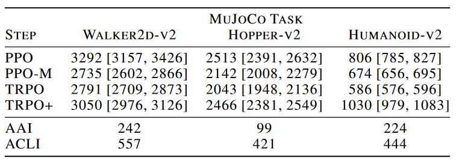

[Implementation Matters in Deep Policy Gradients: A Case Study on PPO and TRPO](https://vitalab.github.io/article/2020/01/14/Implementation_Matters.html)

感覺好唔公道……有用到咁多比較大影響嘅 trick，但係原論文入邊冇點提到……所以真係嗰句，冇公開原始code同復現結果嘅話，同埋隱藏咗實現細節嘅，都要打個問號

**！！ablation！！**

以後自己睇其他papers，都要關注有冇code，同埋code會唔會有啲冇提及嘅trick……影響咁大都得嘅！

當然，都可以講 PPO 可以降低計算成本，訓練得更快，而 code 上邊嘅 trick 提高性能